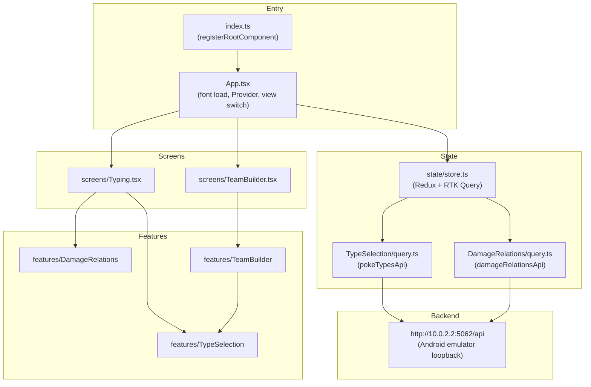
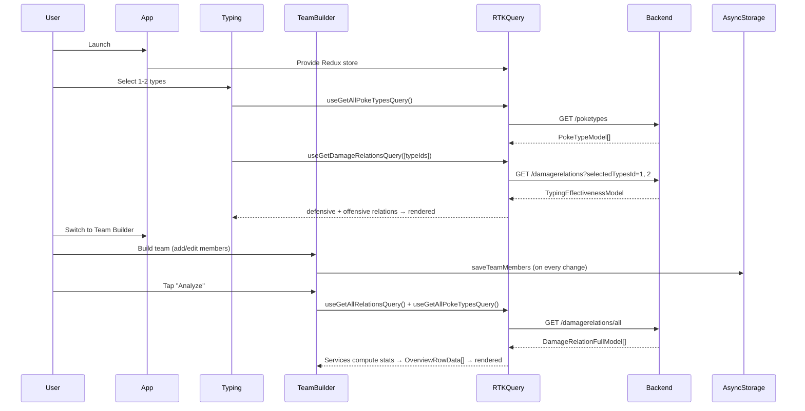

# Codebase Map

> Auto-generated by Cartographer. Last mapped: 2026-05-05T10:39:36Z

## System Overview

**Pocket Type Chart** is an Expo/React Native app with two main screens: a type-chart viewer (select up to 2 Pokemon types, see their matchups) and a team builder (compose a 6-member team, see coverage analysis). There is no navigation library — a single boolean in `App.tsx` toggles between screens.



## Directory Structure

```
pocket-type-chart/
├── App.tsx                          # Root: font loading, Redux Provider, screen toggle
├── index.ts                         # Expo entry — registerRootComponent
├── api/
│   └── apiInstance.ts               # Axios instance (unused — RTK Query bypasses it)
├── constants/
│   ├── colors.ts                    # All color tokens (~40 named constants + MemberColor)
│   ├── http.ts                      # BASE_URL + endpoint path constants
│   ├── icons.ts                     # 28 member icon definitions (NOT in barrel)
│   ├── strings.ts                   # User-facing text and hint copy
│   ├── style.ts                     # Shared spacing/sizing constants
│   ├── typography.ts                # FONTS + FONT_SIZE scale
│   └── index.ts                     # Barrel (re-exports colors, http, strings, style, typography)
├── state/
│   └── store.ts                     # Redux store with both RTK Query slices
├── screens/
│   ├── Typing.tsx                   # Type chart screen
│   └── TeamBuilder.tsx              # Team builder screen
├── features/
│   ├── TypeSelection/               # Type list UI + pokeTypesApi RTK slice
│   ├── DamageRelations/             # Matchup display UI + damageRelationsApi RTK slice
│   └── TeamBuilder/                 # All team management logic, services, and analysis UI
├── shared/
│   ├── components/                  # NavBar, TopBar, Error, Loading, NoTypesSelected
│   ├── storage/                     # AsyncStorage helpers (teamStorage.ts)
│   ├── typohraphy/                  # Typography components (note: dir name is a typo)
│   └── ui/                          # Reusable UI primitives (Card, HintButton, buttons…)
├── docs/
│   └── CODEBASE_MAP.md              # This file
└── assets/img/                      # Static images (error.png, notypes.png)
```

---

## Module Guide

### Entry & App Shell

**Entry point:** `index.ts` → `App.tsx`

`App.tsx` does three things at startup: loads Inter fonts via `expo-font`, holds the splash screen until fonts resolve, then renders `<Provider store={store}><SafeAreaProvider>`. It owns a single `teamBuilderOpen: boolean` state that determines which screen renders. Font loading is the only splash-screen gate — a silent failure means the splash never hides.

**Known issues in `App.tsx`:**
- `appContainer` style is defined but never applied.
- Android nav bar is always forced to `"light"` button style (no dark variant).

---

### State — Redux Store (`state/store.ts`)

| Export | Purpose |
|--------|---------|
| `store` | Configured Redux store |

Both RTK Query API slices are registered here. `serializableCheck: false` globally disables the serialization check (suppresses RTK Query internals, but also hides real issues).

---

### Constants (`constants/`)

| File | Key Exports | Notes |
|------|------------|-------|
| `colors.ts` | ~40 color tokens, `MEMBERS_COLORS`, `MemberColor` | `PRIMARY` is **not defined here** but is imported by `DefaultButton` and `TeamBuilderHeader` — resolves to `undefined` at runtime |
| `http.ts` | `BASE_URL`, `*_ENDPOINT` | Active URL targets Android emulator loopback; Azure URL is commented out |
| `icons.ts` | `MEMBER_ICONS`, `MemberIconDef` | **Not re-exported from barrel** — import directly |
| `strings.ts` | `OVERVIEW_STRINGS`, alert copy, `MORE_DETAILS_*` labels | Dynamic strings expressed as `(count: number) => string` functions |
| `style.ts` | `PADDING`, `MARGIN_HORIZONTAL`, `*_FONT_SIZE` | Basic spacing values |
| `typography.ts` | `FONTS`, `FONT_SIZE` | `FONTS.regular` has a typo (`"Inter_500RMedium"`); `FONTS.medium` references a weight not loaded in `App.tsx` |

**Font system is partially broken:** Several components reference font families that are never loaded in `App.tsx` (`Inter_200ExtraLight`, `Raleway-Thin`, `Inter_600SemiBold`). All silently fall back to the system font.

---

### Feature: TypeSelection (`features/TypeSelection/`)

**Purpose:** Fetches all 18 Pokemon types from the API and provides the type-picker UI.

| File | Purpose |
|------|---------|
| `types.ts` | `PokeTypeModel { id, name, sprite }` — the foundational type used across all features |
| `query.ts` | `pokeTypesApi` / `useGetAllPokeTypesQuery` — GET `/poketypes` |
| `components/PokeTypeList.tsx` | 3-column FlatList of types with Loading/Error states |
| `components/PokeType.tsx` | Individual selectable type sprite with selection overlay |

**Gotchas:**
- `query.ts` has a `console.log(res)` in `transformResponse` — debug logging left in.
- `PokeTypeList` uses a controlled/uncontrolled hybrid: internal `selectedTypes` synced from prop via `useEffect`, which can flash incorrect state during async updates.

---

### Feature: DamageRelations (`features/DamageRelations/`)

**Purpose:** Fetches damage relations for selected types and displays offensive/defensive matchup lists.

| File | Purpose |
|------|---------|
| `types.ts` | `DefensiveDamageRelationModel`, `OffensiveDamageRelationModel`, `TypingEffectivenessModel`, `DamageRelationFullModel` |
| `query.ts` | `damageRelationsApi` — `useGetDamageRelationsQuery(selectedTypes)` and `useGetAllRelationsQuery()` |
| `components/Relations.tsx` | Fetches data, splits into defensive/offensive, renders sub-lists |
| `components/defensiveRelations/` | `DefensiveRelationsList` (grouped by multiplier) + `DefensiveDamageRelation` (single item) |
| `components/offensiveRelations/` | `OffensiveRelationsList` (grouped by attacking type) + `OffensiveDamageRelation` (single item) |

**Cross-feature dependency:** `DamageRelations/types.ts` imports `PokeTypeModel` from `TypeSelection/types.ts`. TypeSelection is the foundational feature.

**Gotchas:**
- Query param serialization: `selectedTypes.join(", ")` — space after comma is backend-specific.
- `OffensiveRelationsList.tsx` line 22: `console.log;` is a dangling no-op statement (debug leftover).
- `OffensiveDamageRelation` does not apply `formatMultiplier` (inconsistent with `DefensiveDamageRelation`).
- `RelationsHeader` uses `==` (loose equality); `OffensiveRelationsHeader` uses `===` — inconsistency.

---

### Feature: TeamBuilder (`features/TeamBuilder/`)

The largest and most complex feature. Has three sub-layers: services (pure computation), components/team (roster management), and components/teamAnalysis (analysis display).

#### Types

`features/TeamBuilder/types.ts` — `TeamMemberModel { id, name, types, iconId, iconColor }`. Max-2 types is enforced by UI, not the model.

#### Services

Data flows through three service layers, all composed in `TeamOverview.tsx`:

```
DamageRelationFullModel[] + TeamMemberModel[]
    ↓ teamRelationsService().calculateTeamRelations()
TeamRelationsResult { defensiveRelations, offensiveRelations }
    ↓ defensiveStatsService(defensiveRelations).calculate()
DefensiveStats { criticalWeaknesses, majorWeaknesses, multiple4xVulns, noSafeSwitchAgainst }
    ↓ offensiveStatsService(offensiveRelations, team, allTypes).calculate()
OffensiveStats { noSuperEffectiveCoverage, severlyResistedTypes, ovelappingOffensiveTypes }
    ↓ overviewRowsService(stats, allTypes, team, allRelations).getRowData()
OverviewRowData[]  →  WeaknessesContainer (Weakness rows only)
```

| Service | File | Purpose |
|---------|------|---------|
| `teamRelationsService` | `services/teamRelationsService/teamRelationsService.ts` | Aggregates per-member type multipliers against all 18 types; nets dual-type multipliers per member |
| `defensiveStatsService` | `services/teamStats/defensiveStatsService.ts` | Identifies critical weaknesses (4+ members), major weaknesses (3 members), multiple 4x vulns, no-safe-switch types |
| `offensiveStatsService` | `services/teamStats/offensiveStatsService.ts` | Identifies types the team can't threaten, types that resist too many members' STAB, overlapping offensive types (3+ members sharing a type) |
| `overviewRowsService` | `services/overviewRows/overviewRowsService.tsx` | Transforms stats into `OverviewRowData[]` for rendering (uses Builder pattern via `OverviewRowDataBuilder`) |

**Known service issues:**
- `teamRelationsService` internally calls `prepareStats()` inside `prepareResult()` but discards the result — dead code.
- `defensiveStatsService` implementation signature is `(defensiveRelations)` → `{ calculate() }`, but its tests call `()` → `{ calculate(defensiveRelations) }` — **API mismatch; those tests will fail**.
- `overviewRowsService` imports the `Stats` type from `TeamOverview.tsx` (a component) — architectural inversion; `Stats` should live in a types file.
- `ovelappingOffensiveTypes` is a typo (missing 'r') propagated through types, service, and tests.
- Strength and Suggestion rows are generated by `overviewRowsService` but immediately filtered out in `TeamOverview` — wasted computation.

#### Components — Team Roster

| File | Purpose |
|------|---------|
| `components/team/TeamList.tsx` | Root: manages team state (add/edit/delete up to 6), persists to AsyncStorage, triggers analysis |
| `components/team/TeamMember.tsx` | Display row for one member (icon, name, types) |
| `components/team/memberDetails/MemberDetails.tsx` | Modal editor: name + types (reuses `PokeTypeList`) + icon + color |
| `components/team/memberDetails/MemberIconSelection.tsx` | Horizontal scroll pickers for icon and color |
| `components/team/memberDetails/MemberName.tsx` | Deferred-commit text input (trims on blur) |

**Gotchas in roster:**
- Storage key uses `"quiztracker.teamMembers.v1"` prefix — leftover from a prior project.
- `MEMBER_ICONS.find(x => x.id === member.iconId)!` non-null assertion will throw if a stored `iconId` no longer exists in `MEMBER_ICONS`.
- Persistence skips the initial mount via `useRef(didLoad)` to avoid overwriting saved data with an empty array.
- New member type replacement is FIFO: if 2 types exist and a 3rd is toggled, it drops `types[0]` without warning.

#### Components — Team Analysis

| File | Purpose |
|------|---------|
| `components/teamAnalysis/TeamAnalysis.tsx` | Layout compositor — renders `MembersPreview` + `TeamOverview` |
| `components/teamAnalysis/membersPreview/MembersPreview.tsx` | Horizontal scroll of member cards with custom scroll indicator |
| `components/teamAnalysis/membersPreview/MemberPreview.tsx` | Compact card: icon + truncated name + type sprites |
| `components/teamAnalysis/teamOverview/TeamOverview.tsx` | **Orchestrator**: wires all services, owns `Stats` type export |
| `components/teamAnalysis/teamOverview/WeaknessesContainer.tsx` | Themed card wrapping all weakness `OverviewRow` items |
| `components/teamAnalysis/teamOverview/OverviewRow.tsx` | Rich weakness card: badge + header + progress bar + subtext + suggestions |
| `components/teamAnalysis/teamOverview/OverviewRowBadge.tsx` | Severity-aware left icon badge |
| `components/teamAnalysis/teamOverview/OverviewRowSuggestedTypes.tsx` | Horizontal wrapping list of type sprite suggestions |
| `components/teamAnalysis/teamOverview/MoreDetails.tsx` | Collapsible raw relation counts — **offensive values are hardcoded placeholders** |
| `components/teamAnalysis/teamOverview/DetailsRow.tsx` | Label + value + hint button row |

**Gotchas in analysis:**
- Two `console.log` calls in `TeamOverview.tsx` (lines 50 and 63).
- `MoreDetails` offensive section uses hardcoded values `4`, `12`, `1` — incomplete implementation.
- `WeaknessesContainer` uses `index` as React key — safe only because the array is never reordered independently.

---

### Shared (`shared/`)

#### Components

| File | Purpose |
|------|---------|
| `NavBar.tsx` | Two-tab bottom nav: "Type Chart" / "Team Builder". Active tab is non-pressable. |
| `TopBar.tsx` | App header with conditional "CLEAR SELECTED" button. References `"Raleway-Thin"` (not loaded). |
| `Error.tsx` | Full-screen error state with retry button. Component name shadows global `Error`. |
| `Loading.tsx` | Centered activity spinner. |
| `NoTypesSelected.tsx` | Empty-state prompt on Typing screen when no types chosen. |

#### Storage

`shared/storage/teamStorage.ts` — `loadTeamMembers`, `saveTeamMembers`, `clearTeamMembers`. All errors are caught and `console.warn`'d; callers cannot distinguish "no saved data" from "storage failed".

#### Typography (`shared/typohraphy/` — note typo in dir name)

All components accept `{ children, style? }` and wrap a `<Text>` with pre-set font/size/color from constants. `Subtitle` wraps in a `<View>` (unlike all others), which affects flex layout behavior.

#### UI Primitives (`shared/ui/`)

| Component | Purpose |
|-----------|---------|
| `Card` | Base rounded dark card container |
| `CardWithHeader` | Card + header with title, optional subtitle, optional icon ("shield"/"sword") |
| `CardWithHeaderRelations` | Card variant using type sprites in the header |
| `DefaultButton` | Primary action button — background uses `PRIMARY` which is `undefined` (bug) |
| `HintButton` | `?` tooltip button with animated modal, screen-edge-aware positioning |
| `OffensiveRelationsHeader` | Section header for offensive matchup groups |
| `RelationsHeader` | Section header for defensive matchup groups |
| `OptionButton` | Small 32×32 icon button with 3 semantic variants (options/error/info) |
| `TwoTypesHeader` | 1–2 type sprites + message (assumes 200×44px sprite aspect ratio) |

---

## Testing

Tests live in `features/TeamBuilder/services/__tests__/`. No UI component tests exist.

### Fixture strategy

| Fixture | Purpose |
|---------|---------|
| `damageRelations.fixture.ts` | Full real Pokemon damage relation data (all 18 types × all 18 types) |
| `types.fixture.ts` | `ALL_TYPES_FIXTURE` array + `TypeId` enum for readable assertions |
| `teams/teamA–F.ts` | 6 team configurations of increasing complexity |
| `expected/defensive/teamA–C.ts` | Pre-computed expected `DefensiveRelations` for teams A/B/C |
| `expected/offensive/teamA–C.ts` | Pre-computed expected `OffensiveRelations` for teams A/B/C |

**Test helper:** `assertRelations.ts` — `expectDefensive` / `expectOffensive` sort both arrays before `toEqual` to allow order-independent comparison.

### Coverage summary

| Suite | Files | Tests |
|-------|-------|-------|
| `teamRelationsService` | 6 files (3 defensive, 3 offensive) | 18 tests |
| `teamStats` defensive | 4 files | 12 tests |
| `teamStats` offensive | 3 files | 9 tests |

**Critical:** Defensive stats test files call `defensiveStatsService()` with no args then `calculate(defensiveRelations)` — this mismatches the actual implementation signature `defensiveStatsService(defensiveRelations)` → `calculate()`. These tests will currently fail.

---

## Data Flow



---

## Conventions

- **Style:** Prettier — double quotes, trailing commas, 90-char line width, 2-space indent.
- **ESLint:** Expo recommended + `simple-import-sort` + `unused-imports` + strict hooks rules. Arrow-function component style enforced.
- **Components:** Named arrow-function exports (`export const X = () => {}`), except `DefaultButton` which is a default export.
- **Services:** Factory function pattern returning a methods object — `fooService(args)` → `{ calculate(), ... }`.
- **No navigation library:** Screen switching is a boolean in `App.tsx`. `NavBar` receives `switchViews` callback from root.
- **No path aliases:** All imports use relative paths.
- **Constants barrel:** `constants/index.ts` re-exports most constants; `constants/icons.ts` is the exception and must be imported directly.

---

## Known Bugs / Technical Debt

| Issue | Location | Impact |
|-------|----------|--------|
| `PRIMARY` color is undefined | `constants/colors.ts` (missing) | `DefaultButton` has no background; `TeamBuilderHeader` border/shadow invisible |
| Font mismatches | `constants/typography.ts`, `App.tsx` | Several components silently fall back to system font |
| `defensiveStatsService` API mismatch | Service vs tests | Defensive stats tests currently fail |
| `Stats` type imported from component | `overviewRowsService` ← `TeamOverview` | Architectural inversion; hard to test in isolation |
| Hardcoded offensive values in `MoreDetails` | `MoreDetails.tsx` | Offensive details section shows `4 / 12 / 1` regardless of team |
| Dead `prepareStats()` call | `teamRelationsService.ts` | Wasted computation each analysis run |
| `Strength`/`Suggestion` rows computed, never shown | `TeamOverview.tsx` | Wasted computation each analysis run |
| `console.log` in `TeamOverview` | Lines 50, 63 | Debug output in production |
| `console.log(res)` in `TypeSelection/query.ts` | `transformResponse` | Debug output in production |
| `console.log;` dangling statement | `OffensiveRelationsList.tsx:22` | No-op, lint should catch this |
| Storage key prefix `quiztracker` | `teamStorage.ts` | Misleading namespace from a prior project |
| `ovelappingOffensiveTypes` typo | `types.ts`, service, tests | Propagated typo; breaking rename would require touching tests |
| `typohraphy` dir name typo | `shared/typohraphy/` | All imports use the misspelled path |
| `axios` instance unused | `api/apiInstance.ts` | Dead file; RTK Query uses `fetchBaseQuery` directly |
| `timeout` in axios `headers` | `api/apiInstance.ts` | Not a valid axios timeout; has no effect |

---

## Navigation Guide

**To add a new API endpoint:**
1. Add path constant to `constants/http.ts`
2. Add endpoint to the relevant RTK Query slice (`features/DamageRelations/query.ts` or `features/TypeSelection/query.ts`), or create a new slice and register it in `state/store.ts`

**To add a new team analysis stat:**
1. Add types to `features/TeamBuilder/services/teamStats/types.ts`
2. Add computation to `defensiveStatsService.ts` or `offensiveStatsService.ts`
3. Update `TeamOverview.tsx` to include the new stat in the `Stats` object and pass to `overviewRowsService`
4. Add a new row generator in `overviewRowsService.tsx`
5. Add string copy to `constants/strings.ts`

**To add a new member icon:**
1. Add an entry to the `MEMBER_ICONS` array in `constants/icons.ts`

**To add a new screen:**
1. Create the screen component in `screens/`
2. Add a toggle state in `App.tsx`
3. Add a tab to `shared/components/NavBar.tsx`

**To modify the base API URL:**
1. Edit `constants/http.ts` — uncomment the appropriate `BASE_URL` variant (LAN or Azure)

**To run a single test file:**
```bash
npx jest features/TeamBuilder/services/__tests__/defensiveStatsService.test.ts
```
